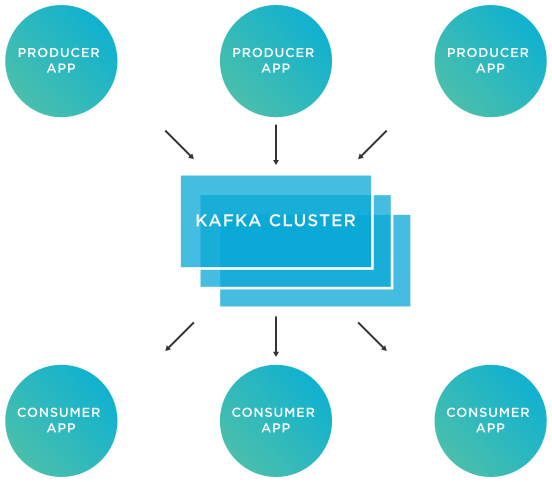

# Data Recovery
## Overview
### What is Data Recovery?
Data recovery in databases refers to the process of restoring the database to a consistent state after a failure or error. This can include restoring the database to a previous state, recovering lost or corrupted data, and ensuring that the database is in a consistent and usable state.

### Methods of Data Recovery
There are several methods for data recovery in databases, including:

1) **Backups**: Regularly creating backups of the database and its data allows for a complete restoration of the database in case of failure.
2) **Point-in-time recovery**: Allows for the restoration of the database to a specific point in time, allowing for the recovery of lost data or undoing recent changes.
3) **Log Shipping**: Copying transaction logs to another location, allowing for a secondary database to be used for recovery in case of failure.
4) **Replication**: Copying data from a primary database to a secondary database, allowing for the secondary database to be used in case of failure.

In our case, we have taken the `Log Shipping` mechanism, and upgraded it to what is known as `Event Sourcing`.

## Event Sourcing
**Event sourcing** is a pattern for managing the state of a service by recording all changes to the state as a sequence of events. This allows for a complete history of the state to be maintained, and for the current state of the service to be rebuilt from the events.

### How it works
In event sourcing, instead of storing the current state of an entity, the service stores all the events that have occurred to that entity, in the order they occurred. When a request is made to the service, it uses these events to rebuild the current state of the entity.

For example, if a user updates their address, instead of updating the user's address in the database, an event "User address updated" is recorded with the new address. This event can then be used to rebuild the current state of the user's address, as well as to track the history of the address changes.

## Benefits
Event sourcing has several benefits:

+ **Auditing and debugging**: Having a complete history of events allows for easy auditing and debugging of the service.
+ **Disaster recovery**: The service can be easily restored to a previous state by replaying the events.
+ **Decentralized and scalable**: Event sourcing allows for a decentralized and scalable architecture, as events can be easily shared and consumed by other services or systems.
+ **Observability**: Event sourcing allows for better observability and debugging of the service, as all changes to the state can be tracked through the event log.

## Apache Kafka
Apache Kafka is a distributed streaming platform that allows for the handling of real-time data feeds. It is used for building real-time data pipelines and streaming applications.

### Features
+ **Scalable**: Kafka can handle a large number of messages, and can scale horizontally by adding more brokers.
+ **Fault-tolerant**: Kafka stores all published messages for a configurable amount of time, allowing for fault-tolerance in case of failures.
+ **Low latency**: Kafka is designed for low-latency processing of real-time data.
+ **High throughput**: Kafka can handle a high volume of data and supports batch processing of data.
+ **Real-time**: Kafka allows for real-time data processing and analysis.

### Architecture
Kafka is a distributed system, with each node in the system called a broker. Producers write data to topics, which are partitioned and replicated across multiple brokers for fault-tolerance. Consumers can then read from the partitions, and can read from a specific offset.

Kafka also has a built-in mechanism for balancing the load across the brokers, called a partition leader. The partition leader is responsible for all reads and writes for a specific partition, and if the leader goes down, a new leader is automatically elected.

### Use cases
+ **Real-time data streaming**: Kafka can be used to process real-time data streams, such as log data, financial data, or social media data.
+ **Messaging**: Kafka can be used as a messaging system, with producers writing messages to topics and consumers reading from topics.
+ **Event sourcing**: Kafka can be used as an event store, with producers writing events to topics and consumers reading from topics to rebuild the current state of an entity.

### Our use case
I have used `Apache Kafka` to achieve many goals, an one of them is event sourcing and data recovery as mentioned before.
