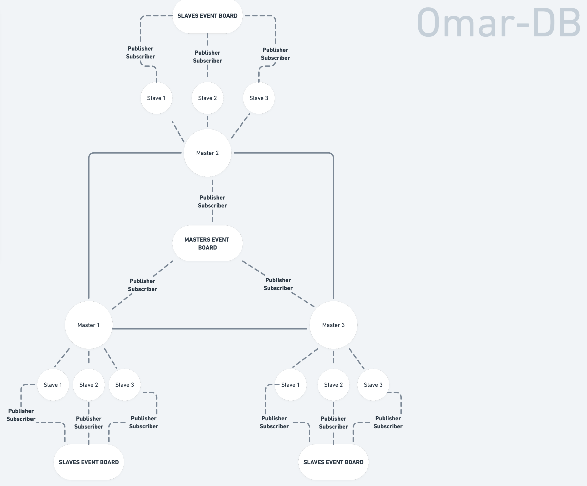

# High Level Architecture: System Design 
## Master-Slave Architecture
Master-slave architecture is a design pattern used in databases to increase reliability and scalability. This architecture involves having two or more database instances where one instance acts as the master database and the others act as slaves. The master database is responsible for handling write operations, while the slave databases are responsible for handling read operations.

### Advantages of Master-Slave Architecture
+ **Increased reliability**: In a master-slave architecture, if the master database fails, a slave database can take over its role. This ensures that the database remains available even in the event of a failure.
+ **Improved scalability**: As the number of users increases, the master database can become a bottleneck. By using a master-slave architecture, read operations can be spread across multiple slave databases, reducing the load on the master database.
+ **Better performance**: The slave databases can be used to cache frequently used data, improving performance.

### 1- _Master Nodes_:
+ They are responsible for handling **Write** actions.
+ All nodes are connected with each other following what is almost a **P2P** protocol.
+ By default, there will be 3 **Master Nodes**, which are replicas of each other, this number can be configured by the user.
+ There is a **Publisher-Subscriber** relationship between all **Master Nodes**, if a node approves a write action and once completed, a **Write Event** will be published, such that all other **Master Nodes** can replicate the results.
+ **Write Events** will be published to a **Master Nodes Event Board**, which can be accessed only by a **Master Node**
+ Replicating any published event shall be done by a separate thread, which should be limited depending on the availability of resources in each node, such that nodes stand still in their comfort zone.

### 2- _Slave Nodes_
+ They are responsible for handling **Read** actions.
+ Each **Master Node** has by default 3 **Slave Nodes** as children, which are replicas of their parent **Master Node**, this number can be configured by the user.
+ There is a **Publisher-Subscriber** relationship between any **Master Node** and its **Slave Nodes**, if a node approves a write action and once completed, a **Write Event** will be published, such that all its **Slave Nodes** can replicate the results.
+ If a **Master Node** approves and completes a **Write Event**, and in order for its **Slave Nodes** to replicate the results, **Write Events** will be published to a **Slave Nodes Event Board**, which can be accessed only by the **Slave Nodes** of the publisher **Master Node**.

### Usage
I have used Master-Slave Architecture to achieve eventual consistency and performance in microservice architecture, by having master nodes as write nodes, and slave nodes as read nodes.

## Peer-to-Peer (P2P) Architecture
Peer-to-Peer (P2P) architecture is a distributed computing model that allows each node in the network to act as both a client and a server. In the context of databases, this architecture allows each node to hold a copy of the entire database, allowing for decentralized data storage and retrieval.

### Advantages of Peer-to-Peer Architecture
+ **Decentralized**: In a P2P architecture, there is no central authority or server, making the system more resilient to failures.
+ **Increased reliability**: Each node in a P2P network holds a copy of the database, so if one node fails, the data is still available from other nodes.
+ **Improved scalability**: As the number of nodes in the network increases, the system can handle more data and more queries, making it easier to scale.
+ **Reduced latency**: In a P2P network, data can be retrieved from the closest node, reducing latency compared to a centralized system.

### Usage
I have used Peer-to-Peer Architecture to achieve the capability of communication between multiple nodes, such that a change of data in one node can take effect in all other nodes after a while (hence, eventual consistency).

## Publisher-Subscriber Architecture
Publisher-subscriber (Pub-Sub) architecture is a design pattern used in databases for communication between different components. In a Pub-Sub architecture, publishers produce and send messages, while subscribers receive and process those messages.

### Advantages of Publisher-Subscriber Architecture
+ **Decoupled communication**: Pub-Sub architecture allows different components to communicate without being tightly coupled, improving the overall design of the system.
+ **Scalability**: As the number of subscribers increases, the system can easily scale to accommodate the increased demand.
+ **Improved reliability**: In a Pub-Sub architecture, if a subscriber fails, the other subscribers can continue to receive messages, improving the reliability of the system.
+ **Improved performance**: By using a Pub-Sub architecture, the load on the database can be reduced, as subscribers are responsible for processing messages, rather than the database itself.

### Usage
I have used Publisher-Subscriber Architectures to achieve Peer-to-Peer Architecture through message queues, using Apache Kafka, which we described before.

