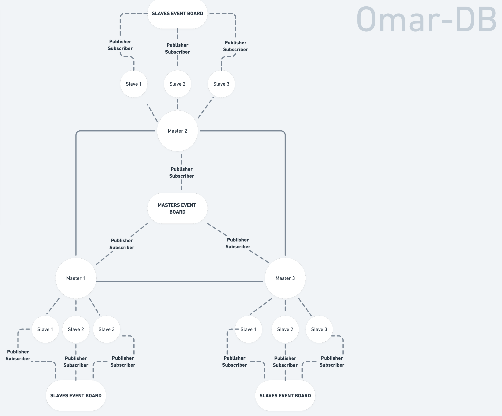

# Omar-DB
#### BASE Model Database for Microservices & Monolithic Environments, with ACID support for a cost

This project is a nothing but a POC, and is considered to be moved to Rust Programming Language in the future in case it proves to have exceptional features, to achieve the expected performance of a Database in any environment.

## Questions To Be Answered
### 1- Apache Kafka
+ Should I use Kafka as a message queue for nodes, or is it an over-kill, and maybe I can use or build something simpler?
+ What configuration is needed for Kafka (Templates, Brokers, Messages, ...etc)?
+ Is the default docker environment enough in the used image?
+ How many brokers would I need, can that be customizable by the user?
+ How much time should a message live, can that be customizable by the user?

### 2- Security
+ Is Spring Security good for the task?
+ Can it handle SSH sessions too?
+ Should I provide more than one method for authentication?
+ What method should I use to manage sessions (most likely through token based authentication)?

### 3- API
+ Should I use REST or GraphQL? 
+ If I used GraphQL, can I simply provide an open-access to all tables, or should that be an option on users end?
+ Is gRCP an option, and what are the advantages?
+ Should I forget about the Web API idea and simply provide a programmatic API/SDK?
+ Would SSH connections be of any advantage?

### 4- Concurrency
+ Haven't though about that yet :")

## High-Level Architecture Design Notes & Decisions

### 1- _Master Nodes_:
  + They are responsible for handling **Write** actions.
  + All nodes are connected with each other following what is almost a **P2P** protocol.
  + By default, there will be 3 **Master Nodes**, which are replicas of each other, this number can be configured by the user.
  + There is a **Publisher-Subscriber** relationship between all **Master Nodes**, if a node approves a write action and once completed, a **Write Event** will be published, such that all other **Master Nodes** can replicate the results.
  + **Write Events** will be published to a **Master Nodes Event Board**, which can be accessed only by a **Master Node**
  + Replicating any published event shall be done by a separate thread, which should be limited depending on the availability of resources in each node, such that nodes stand still in their comfort zone.

### 2- _Slave Nodes_
+ They are responsible for handling **Read** actions.
+ Each **Master Node** has by default 3 **Slave Nodes** as children, which are replicas of their parent **Master Node**, this number can be configured by the user.
+ There is a **Publisher-Subscriber** relationship between any **Master Node** and its **Slave Nodes**, if a node approves a write action and once completed, a **Write Event** will be published, such that all its **Slave Nodes** can replicate the results.
+ If a **Master Node** approves and completes a **Write Event**, and in order for its **Slave Nodes** to replicate the results, **Write Events** will be published to a **Slave Nodes Event Board**, which can be accessed only by the **Slave Nodes** of the publisher **Master Node**.

